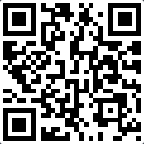

# react-movement-gestures
native accelerometer-based gesture recognition for phones.

## How to try out the current version
- get the expo app for your phone.
- scan the QR code.

## The plan
- Use data from phones to train an RNN (for instance) to classify physical movements.
- Use GPU for training so there is output available before the heat death of the universe (or just a long time from now--I don't know how you calculate your [Hubble Constant](https://en.wikipedia.org/wiki/Hubble%27s_law#Determining_the_Hubble_constant)).
- Update the app to include an online detection mode (and then your phone can _finally_ help decide what you're telling it _as it moves_).
- Port the app out of Expo?

## Great Minds... Work for NIH
I just found out about [MGRA](https://www.ncbi.nlm.nih.gov/pmc/articles/PMC4851044/#!po=21.7172).
It is similar (in part) to what I am doing here.
